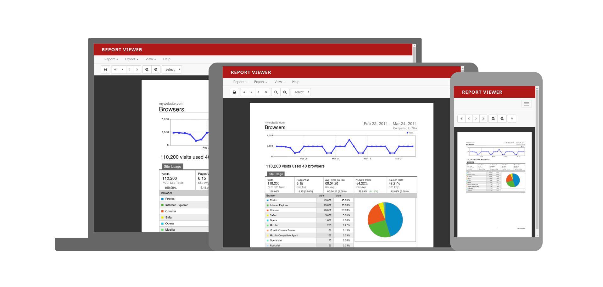

# Saiku Report Viewer User Interface

## Screenshots

|  |  |  |
| :---: | :---: | :---: |
| Mobile | Tablet | Desktop |

## Dependencies:

- Node.js `>=` v6;

## Up and running

- Clone this repository: `git clone git@github.com:OSBI/saiku-react-starter.git`;
- Remove `.git` directory;
- Install dependencies: `yarn` (or `npm i`);
- Run `yarn start` (or `npm start`) to develop on `http://localhost:3000`
- Run `yarn build` (or `npm run build`) for production build (files will be generated on `build` directory)

## Scripts

- `yarn start (or npm start)`: Starts the application
- `yarn test (or npm test)`: Run tests once
- `yarn test:watch (or npm run test:watch)`: Run tests in watch mode
- `yarn build (or npm run build)`: Build project to production
- `yarn storybook (or npm run storybook)`: Run Storybook on 6006 port
- `yarn build-storybook`: Build Storybook to static files

## Contributing

If you want to help, please read the [Contributing](https://github.com/OSBI/saiku-react-starter/blob/master/CONTRIBUTING.md) guide.

## History

For detailed changelog, see [Releases](https://github.com/OSBI/saiku-react-starter/releases).

## License

[Apache License Version 2](https://github.com/OSBI/saiku-react-starter/blob/master/LICENSE) © Meteorite BI
